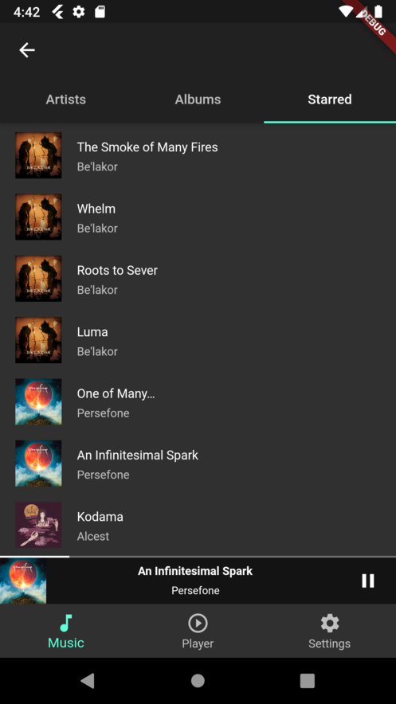
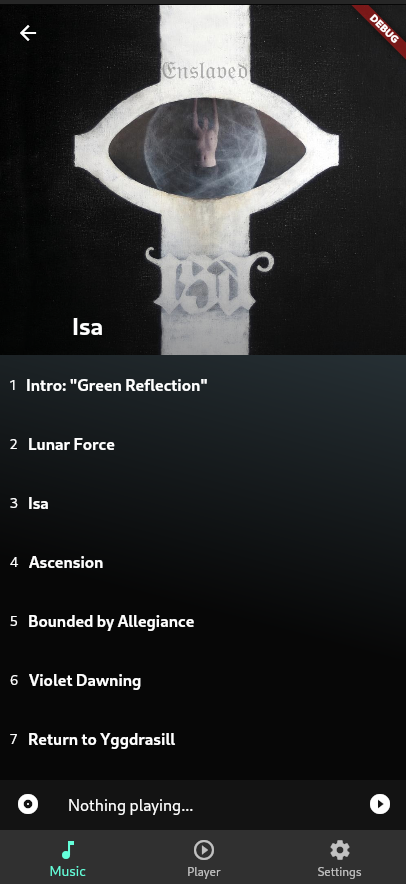

# subsound

A subsonic music player.

## Screenshots

## Release todo

- [ ] fix random breakage of player sometimes. seems like onStart is not working after background player task crashes
- [X] fix blinking in album when selecting different song
- [X] fix intermediate render with blank coverart on artist page
- [X] sort starred by most recently added
- [ ] enqueue next track
- [ ] browse playlists
- [ ] fix package naming

## Goals

- [X] Browsing content
- [X] Audio playback
- [X] Starred songs
- [X] Media players support (lock screens)
  - [X] Android
  - [X] ios
- [ ] A nice, smooth interface
- [X] Make play queue actually work in all contexts
  - [X] Play a song in album with queue
  - [X] Play a song from starred with queue
- [ ] Offline support
  - [ ] Sync content for local access in database
  - [ ] Selective caching

Possible goals:
 - Chromecast
 - Airplay
 - Support other servers than Subsonic compatible APIs
 - Linux
 - Transcoding when needed
 
Non-goals:
 - Video support
 - EQ/Gain

## TODO:
 - [X] Playback support
 - [ ] Fix heavy blinking in UI
   - [ ] on play from album
   - [ ] on play from starred list when nothing is already playing
 - [X] Media players support (lock screens) for Android
 - [X] Media players support (lock screens) for ios
 - [ ] Queue support
 - [ ] Start up the background play task after a crash (or in general it is not running anymore)
 - [X] cache artwork
 - [X] download files
 - [\] cache files
   - [X] partial, should cache files now, but the user has no control over this
 - [ ] link from album back to artist
 - [ ] Album page: Star button in song list
 - [ ] Album page: summary in bottom of song list
 - [ ] Album page: play button
 - [X] Album page: play on click
 - [ ] Album page: Slide to enqueue
 - [ ] Artist page: play button
 - [ ] Search
   - [ ] search page
   - [ ] search button in bottom bar
 - [ ] Song meta: add information about cache state (whether we have the file already downloaded)
 - [X] cache album data
 - [ ] cache song data
 - [ ] cache starred data
 - [ ] cache playlist data
 - [ ] Setup sqlite database + migrations
    - [ ] Store artist index in sqlite db for offline use
 - [ ] Make it work offline
    - [ ] Download starred
    - [ ] store artwork persistent locally
    - [ ] store files persistent locally
    - [ ] store metadata persistent locally in database (as part of a full metadata sync?)

## Eventually
 - [ ] Album page: save button
 - [ ] Artist page: save button
