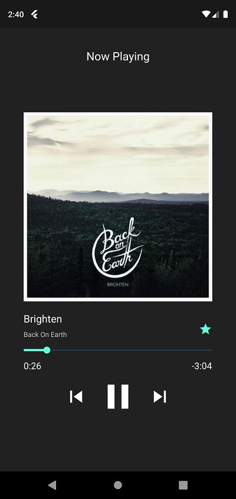

# subsound

A subsonic music player.

## Screenshots

## Release todo

- [ ] fix random breakage of player sometimes. seems like onStart is not working after background player task crashes
- [X] fix crash on cover artwork in albums listing
 - [ ] this was due to flutter engine crashing on a broken GIF file
- [ ] enqueue next track
- [X] fix blinking in album when selecting different song
- [X] fix intermediate render with blank coverart on artist page
- [X] sort starred by most recently added
- [X] fix package naming
- [X] crash reporting
- [ ] pull-to-refresh on starred/artists/albums?
- [ ] find an app icon
  - [ ] android
  - [ ] ios
- [ ] Play Store
  - [ ] app icon 512x512px
  - [ ] graphics feature: 1024x500px image
- [ ] App Store
  - [ ] ???

## Goals

- [X] Browsing content
- [X] Audio playback
- [X] Starred songs
- [X] Media players support (lock screens)
  - [X] Android
  - [X] ios
- [X] A nice, smooth interface
- [X] Make play queue actually work in all contexts
  - [X] Play a song in album with queue
  - [X] Play a song from starred with queue
- [ ] Airplay
- [ ] Shuffle modes
- [ ] Loop modes
- [ ] Offline support
  - [X] Play music from cache
  - [X] Browse data without loading live from API only
  - [ ] deliver artwork to system notification from cache
  - [ ] Sync content for local access in database
  - [ ] Store metadata persistently for offline mode
  - [ ] Selective caching

Possible goals:
 - Chromecast
 - Support other servers than Subsonic compatible APIs
 - Linux
 - Transcoding when needed/wanted
 
Non-goals:
 - Video support
 - EQ/Gain
 - Jukebox support/remote playing

## TODO:
 - [X] Playback support
 - [X] Media players support (lock screens) for Android
 - [X] Media players support (lock screens) for ios
 - [X] Queue support
   - [X] a play queue
   - [ ] view queue
   - [ ] edit queue?
 - [ ] Start up the background play task after a crash (or in general it is not running anymore)
 - [X] cache artwork
 - [X] download files
 - [\] cache files
   - [X] partial, should cache files now, but the user has no control over this
   - [ ] cache artwork for system notification. have to deliver a file:/// 
         to the system notification so it does not load the artwork over the network
 - [X] link from album back to artist
 - [ ] playlists
  - [X] playlist api
  - [ ] playlist listing
  - [ ] new homescreen with
     - [ ] recent albums
     - [ ] recent playlists
     - [ ] starred songs
 - [ ] Album page: Star button in song list?
 - [ ] Album page: summary in bottom of song list?
 - [ ] Album page: play button?
 - [X] Album page: play on click
 - [ ] Album page: Slide to enqueue
 - [ ] Artist page: play button
 - [ ] Search
   - [ ] search page
   - [ ] search button in bottom bar
 - [ ] Song meta: add information about cache state (whether we have the file already downloaded)
 - [ ] local cache:
     - [X] artist data
     - [X] album data
     - [X] song data
     - [X] starred data
     - [ ] playlist data
 - [ ] Setup sqlite database + migrations
    - [ ] Store artist index in sqlite db for offline use
 - [ ] persistent cache (offline mode):
     - [ ] artist data
     - [ ] album data
     - [ ] song data
     - [ ] starred data
     - [ ] playlist data
 - [ ] Make it work offline
    - [ ] Download starred?
    - [ ] store artwork persistent locally
    - [ ] store files persistent locally
    - [ ] store metadata persistent locally in database (as part of a full metadata sync?)

## UX ideas
 - [ ] slide animation in player when skipping next/prev song

## Eventually
 - [ ] Album page: save button
 - [ ] Artist page: save button
